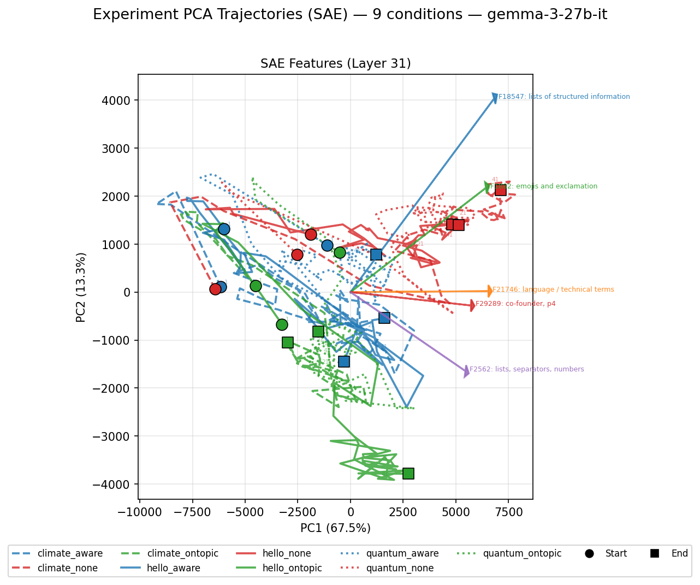
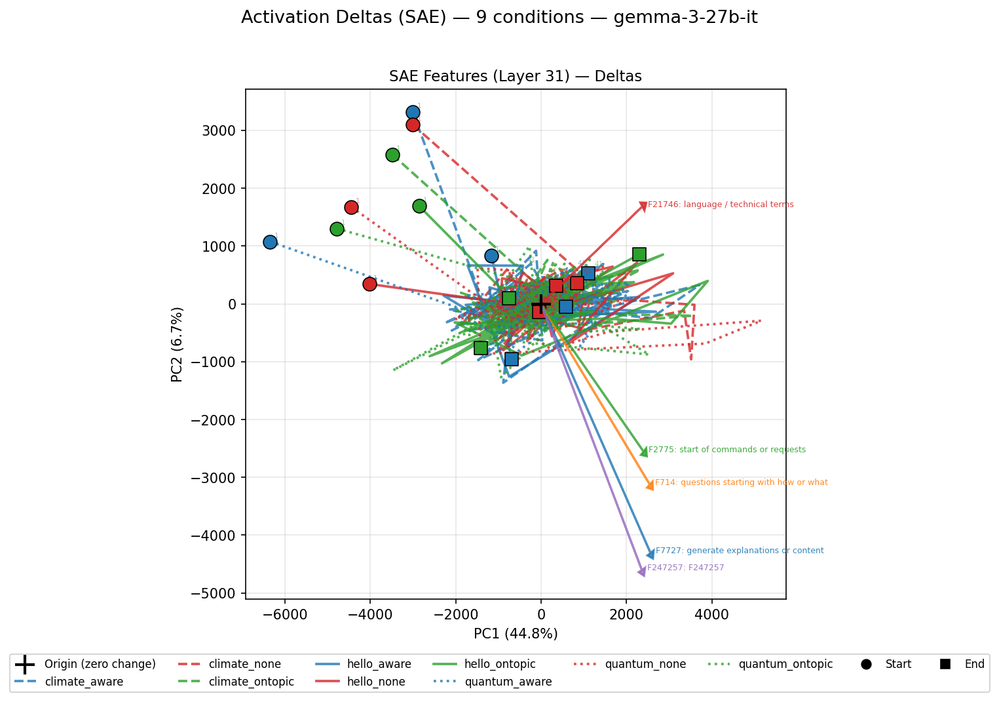

# Gemma Attractors

Whitebox study of attractor dynamics in LLM-to-LLM conversations for `google/gemma-3-27b-it`.

## Experimental Setup

**9 conditions** (3 openers x 3 system prompts), 10 transcripts per condition, 50 turns each.

| | `none` (no system prompt) | `aware` ("You are an AI talking to another AI") | `ontopic` ("Stay strictly on topic") |
|---|---|---|---|
| **hello** ("Hello.") | hello_none | hello_aware | hello_ontopic |
| **climate** ("How can we solve climate change?") | climate_none | climate_aware | climate_ontopic |
| **quantum** ("What is the measurement problem in quantum mechanics?") | quantum_none | quantum_aware | quantum_ontopic |

All conversations use the same model on both sides (`gemma-3-27b-it` via OpenRouter).

## Feature Extraction

For each message in each transcript:
1. Run an independent forward pass through `gemma-3-27b-it`
2. Extract residual stream activations at layer 31
3. Encode through a [JumpReLU SAE](https://huggingface.co/google/gemma-scope-2-27b-it) (262k features, `resid_post/layer_31_width_262k_l0_medium`)
4. Mean-pool the SAE feature vector over content tokens to get one 262k-dimensional feature vector per message

Per condition, Model A (even turns) and Model B (odd turns) are averaged at each turn position, then averaged across the 10 transcripts (using Welford's online mean). This gives a single trajectory of mean SAE feature vectors over turns for each condition.

## Results

### SAE Feature Trajectories in PCA Space

PCA of the mean SAE feature vectors over turns, one trajectory per condition. Colors encode system prompt (red=none, blue=aware, green=ontopic), linestyles encode opener (solid=hello, dashed=climate, dotted=quantum). Circle = start, square = end. Arrows show the top 5 SAE features for the PC1.



The 9 conditions separate clearly in PCA space. PC1 (67.5%) largely captures conversation progression over time — all trajectories move left-to-right as conversations evolve. The top PC1 features correspond to the most active features at the end of the conversation, so they are the "attractor" features. Note that the trajectories converge to different points so the attractor state is far from unique. 

The system prompt (color) determines the *region* of feature space the conversation occupies, while the opener (linestyle) affects the starting point and trajectory shape.

### Activation Deltas in PCA Space

Same data, but plotting the *difference* between consecutive SAE feature vectors. This shows the rate and direction of change at each turn. We see that the activation delta converge towards zero. This is the true nature of the attractor, the fact that conversations collapse into repetitive loops,



The deltas start large (circles, early turns — rapid topic development) and converge toward the origin (squares, late turns — repetitive/degenerate content). The top PC1 features in the delta space capture what's *changing most* in early conversation turn, so they are the top early SAE features.

### Terminal Attractor States

The following summary was generated by LLM judges (see `report.txt` and `analysis.txt` for the full analysis).

The central finding is that **all conversations eventually degenerate into content-free recursive loops**, but the *time to degeneracy* and the *character of the terminal state* are predictable from initial conditions. The system prompt is the primary determinant of terminal attractor identity, while the opener controls the duration and richness of the productive transient phase. The most productive conversations arise from the combination of a rich topic (quantum mechanics) with a behavioral constraint (on-topic), while the fastest degeneracy occurs with an ambiguous opener (hello) and no constraints.

## Scripts

| Script | Description |
|---|---|
| `experiment.py` | Generate transcripts (concurrent API calls to OpenRouter) |
| `experiment_trajectory.py` | Extract activations/SAE features, PCA visualization (interactive REPL) |
| `experiment_analysis.py` | Token length statistics across conditions |
| `attractor_analysis.py` | Two-stage LLM judge pipeline (per-transcript summaries + cross-condition report) |
| `llm_dialogue.py` | Core LLM conversation engine |

## Usage

```bash
# Generate transcripts (requires OPENROUTER_API_KEY)
python experiment.py

# Extract SAE features and visualize (requires GPU/MPS for gemma-3-27b-it)
python experiment_trajectory.py --sae

# Use cached features only (no model loading)
python experiment_trajectory.py --sae --skip-extraction
# Interactive commands: pca, delta 5, diff, end, F1,F2,...

# Token length analysis (tokenizer only, no model)
python experiment_analysis.py

# LLM judge analysis (requires OPENROUTER_API_KEY)
python attractor_analysis.py
```
